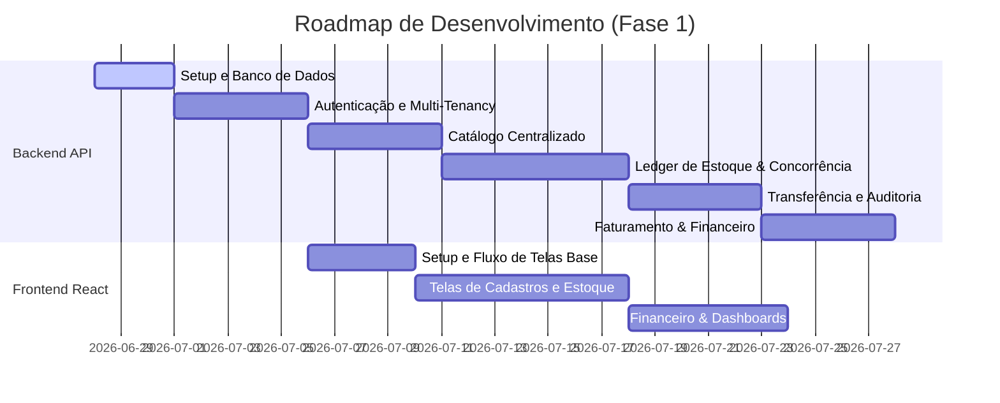

# Cronograma de Desenvolvimento: Gerenciador de Lojas SaaS (Fase 1)

Este documento registra o planejamento técnico macro, as ondas de entrega e o progresso das tarefas concluídas e pendentes para a construção da Fase 1 da plataforma.

---

## 🛠️ Progresso Geral do Projeto

---

## 📋 Ondas de Desenvolvimento e Checklists

### 🌌 Onda 1: Setup, Banco de Dados e Isolamento Multi-tenant
*Objetivo: Estabelecer o alicerce técnico e garantir a segurança lógica dos inquilinos (tenants) no banco de dados.*

* **Infraestrutura e Base**:
  - [x] Configuração de dependências (`requirements.txt`) compatíveis com Python 3.13.
  - [x] Configuração de variáveis de ambiente (`.env`) e ignorados (`.gitignore`).
  - [x] Criação do `docker-compose.yml` (PostgreSQL na porta `5433` para evitar conflito com serviço local, Redis).
  - [x] Estrutura inicial do FastAPI (`src/infrastructure/web/main.py`).
  - [x] Setup do SQLAlchemy e inicialização do Alembic.
  - [x] Criação e validação do banco de testes PostgreSQL (`gerenciador_saas_test`) no Docker.
  - [x] Implementação de testes de conectividade e health check com `pytest`.
  - [x] Criação de branch `chore/setup-inicial` e envio dos commits no padrão Conventional Commits.
* **Autenticação, JWT e Segurança** (Próximo Passo):
  * **Regras de Negócio e Domínio (Responsável: Jonathas)**:
    - [x] Criar entidades de domínio puras de `Tenant` e `Usuario` em Python puro ([src/domain/entities/](file:///C:/Users/jonat/Documents/projeto-gerenciamento-saas/src/domain/entities/)).
    - [ ] Definir exceções de negócio customizadas em [src/domain/exceptions/](file:///C:/Users/jonat/Documents/projeto-gerenciamento-saas/src/domain/exceptions/).
    - [ ] Criar interfaces e contratos abstratos dos repositórios em [src/domain/repositories/](file:///C:/Users/jonat/Documents/projeto-gerenciamento-saas/src/domain/repositories/).
    - [ ] Implementar os casos de uso purificados em Python: `CriarTenant` e `AutenticarUsuario` em [src/use_cases/autenticacao/](file:///C:/Users/jonat/Documents/projeto-gerenciamento-saas/src/use_cases/autenticacao/).
  * **Persistência e Modelagem de Banco (Responsável: Leonardo)**:
    - [ ] Mapear os modelos SQLAlchemy físicos de `tenants` e `usuarios` em [src/infrastructure/database/models.py](file:///C:/Users/jonat/Documents/projeto-gerenciamento-saas/src/infrastructure/database/models.py) e gerar a migração Alembic.
    - [ ] Implementar repositórios SQLAlchemy concretos e configurar o filtro de sessão global do `tenant_id` para isolamento.
  * **Segurança, Web e Testes (Responsável: Douglas)**:
    - [ ] Desenvolver utilitários de segurança: hashing de senhas com `bcrypt` e manipulação de tokens JWT em [src/infrastructure/security/](file:///C:/Users/jonat/Documents/projeto-gerenciamento-saas/src/infrastructure/security/).
    - [ ] Desenvolver as rotas web do FastAPI (`/auth/register`, `/auth/login`) e a dependência de injeção `get_current_user` em [src/infrastructure/web/](file:///C:/Users/jonat/Documents/projeto-gerenciamento-saas/src/infrastructure/web/).
    - [ ] Escrever a suíte de testes automatizados de integração e de simulação de vazamento multi-tenant (*SaaS leakage*) em [tests/](file:///C:/Users/jonat/Documents/projeto-gerenciamento-saas/tests/).

---

### 📦 Onda 2: Catálogo Centralizado (Cadastros Base)
*Objetivo: Criar as tabelas e rotas necessárias para popular o banco de dados antes da movimentação de mercadorias.*

- [ ] Implementação dos modelos e repositórios de `lojas` (filiais físicas).
- [ ] Implementação de `fornecedores` e `clientes` (com limite de crédito de crediário).
- [ ] Implementação de `produtos` (SKU, descrição, margens, preços).
- [ ] Regra de negócio: Cálculo de precificação inteligente sugerida por **Markup**.
- [ ] Rotas de CRUD para todos os cadastros no FastAPI.
- [ ] Testes unitários de validação de schemas do Pydantic.

---

### 🩸 Onda 3: O Coração do Estoque (Ledger & Concorrência)
*Objetivo: Construir a lógica de inventário blindada contra concorrência e falhas de quantidade física.*

- [ ] Criação da tabela de saldos (`estoque_saldos`) e ledger de histórico (`estoque_movimentacoes`).
- [ ] Caso de uso: Entrada de estoque simples e controle de saldo.
- [ ] Implementação do **Bloqueio Pessimista (`SELECT FOR UPDATE`)** nas transações de estoque.
- [ ] Caso de uso: Entrada rápida de estoque através do **Upload e parsing de XML de NF-e**.
- [ ] Testes de concorrência: simulação de requisições simultâneas forçando condições de corrida.

---

### 🚚 Onda 4: Transferências Logísticas e Auditoria Física
*Objetivo: Controlar o trânsito de produtos interlojas e gerenciar contagens rotativas.*

- [ ] Máquina de Estados de Transferência (`SOLICITADO`, `DESPACHADO`, `RECEBIDO`, `DIVERGENTE`).
- [ ] Fluxo de auditoria de divergências e justificativas logísticas.
- [ ] Caso de uso: Auditoria física de estoque (inventário local) com registro automático de perdas.
- [ ] Testes de transição de estados de transferência de estoque.

---

### 💰 Onda 5: Faturamento Administrativo, Financeiro e CRM
*Objetivo: Permitir vendas na retaguarda e integrar com fluxo de caixa e contas a pagar/receber.*

- [ ] Lógica de **Venda Administrativa** (formas de pagamento, descontos e itens de venda).
- [ ] Integração de Caixa: Geração automática de `FinanceiroLancamento` (receita) na finalização de vendas.
- [ ] Regra de Crediário: Incremento de `saldo_devedor_crediario` no cliente se a venda for no crediário.
- [ ] Controle manual de despesas operacionais da loja.
- [ ] Testes de fluxo financeiro completo de ponta a ponta.

---

### 📊 Onda 6: Analytics, Relatórios e Celery Workers
*Objetivo: Gerar inteligência de negócio e enviar fechamentos automáticos.*

- [ ] Endpoints analíticos do Dashboard (Ticket Médio, Faturamento vs Custo, Estoque Crítico/Rupturas).
- [ ] Endpoint da **Curva ABC** de produtos mais lucrativos.
- [ ] Configuração de tarefas agendadas no Celery/Redis: Relatório diário de faturamento por e-mail para donos.

---

### 🖥️ Onda 7: Frontend React (Interface SPA)
*Objetivo: Construir a interface do usuário responsiva e dinâmica.*

- [ ] Setup do React + Vite + Tailwind CSS.
- [ ] Estrutura de rotas protegidas por Roles do JWT (`ADMIN_SAAS`, `DONO`, `GERENTE`).
- [ ] Telas de Login e Configurações de Tenants.
- [ ] Telas de CRUDs (Produtos, Lojas, Funcionários, Clientes, Fornecedores).
- [ ] Painel de Estoque Multiloja e Tela de Transferências.
- [ ] Painel Financeiro e Dashboards analíticos com gráficos interativos.
