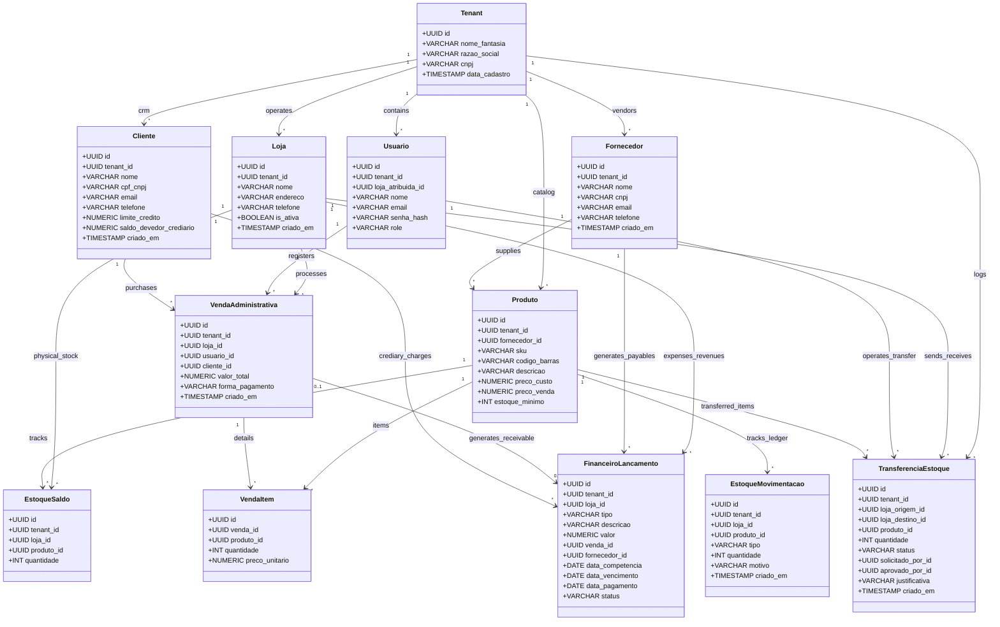
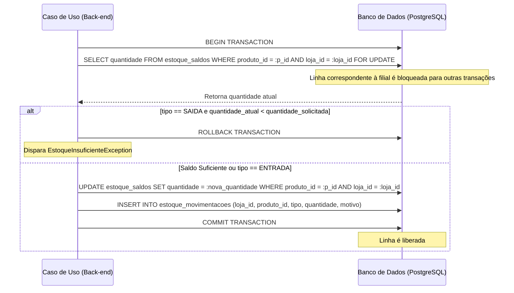
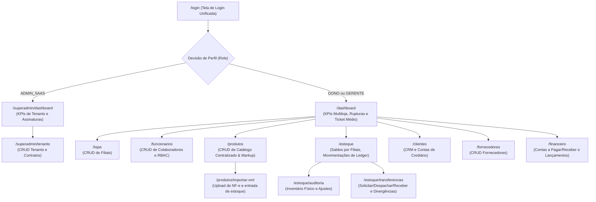

# Especificação Técnica e Funcional: Gerenciador de Lojas SaaS (Fase 1)

---

## Resumo Executivo

Este documento apresenta a especificação técnica e funcional consolidada para a construção da primeira fase do **Gerenciador de Lojas SaaS**, uma plataforma web multi-tenant sob a filosofia de Clean Architecture voltada para o gerenciamento multilojas e de retaguarda. 

O sistema foi projetado para operar sob o modelo de **Software como Serviço (SaaS)** com isolamento lógico rígido de dados (**Multi-tenancy**), permitindo que múltiplos lojistas e franquias gerenciem seus catálogos de produtos, controlem estoques por filial através de importação de Notas Fiscais (XML de NF-e), realizem transferências internas de mercadorias entre filiais, efetuem vendas administrativas com faturamento direto na retaguarda, controlem contas a pagar/receber e analisem relatórios de desempenho e saúde financeira do negócio.

A interface do Ponto de Venda (PDV/Boca de Caixa) avançada de balcão e integrações locais de hardware térmico estão **excluídas** deste escopo de desenvolvimento inicial, sendo consideradas frentes de expansão futura.

---

## 1. Diretrizes Arquiteturais e Tech Stack (Fase 1)

Para garantir que o sistema cresça de forma modular, sustentável e sem se tornar um "monólito bagunçado", o desenvolvimento seguirá rigorosamente os princípios da **Clean Architecture** (Arquitetura Limpa), isolando as regras de negócio puras de frameworks e dependências externas de banco de dados ou web.

### 1.1 Tech Stack
* **Backend**: Python 3.11+ utilizando o framework **FastAPI** (alta performance nativa, suporte robusto a rotas assíncronas e geração de documentação OpenAPI automática via Swagger).
* **Banco de Dados**: **PostgreSQL** para persistência física, essencial por seu suporte maduro a transações relacionais robustas (ACID) e controle fino de travas de concorrência.
* **ORM / Query Builder**: **SQLAlchemy** configurado com mapeamento clássico ou imperativo. Isso separa as entidades puras da camada de domínio dos modelos de tabelas do banco de dados.
* **Mensageria e Filas (Async Workers)**: **Redis** como Message Broker e **Celery** para execução e processamento assíncrono de tarefas em segundo plano (notificações de estoque baixo, alertas e relatórios diários).
* **Frontend**: **React** (Single Page Application) construído com **Vite**, utilizando **Tailwind CSS** para estilização rápida e responsiva, e **Axios** em conjunto com **TanStack Query** (React Query) para o consumo inteligente da API e gerenciamento de estado do servidor.

---

### 1.2 Estrutura de Pastas do Backend

A estrutura interna do backend está organizada de forma a proteger o domínio de alterações nas camadas externas:

```plaintext
src/
├── domain/                      # Camada mais interna (Enterprise Business Rules)
│   ├── entities/                # Entidades de domínio puras (ex: Produto, Tenant, Loja, Venda, Lancamento)
│   ├── exceptions/              # Exceções de negócio customizadas (erros de regra)
│   └── repositories/            # Contratos e Interfaces (Abstrações de persistência)
│
├── use_cases/                   # Camada de Aplicação (Application Business Rules)
│   ├── estoque/                 # Casos de uso: EntradaEstoqueNFe, RegistrarMovimentacao, AuditoriaEstoque, TransferenciaMercadoria
│   ├── financeiro/              # Casos de uso: RegistrarVendaAdministrativa, ConciliarLancamento
│   └── autenticacao/            # Casos de uso: CriarTenant, AutenticarUsuario, GerenciarColaboradores
│
└── infrastructure/              # Camada Externa (Frameworks & Drivers)
    ├── database/                # Modelos SQLAlchemy, Migrations (Alembic) e Repositories concretos
    ├── web/                     # Rotas do FastAPI, Middlewares, Schemas Pydantic
    ├── security/                # Gerenciamento de JWT, Criptografia de senhas (Argon2 / Bcrypt)
    └── workers/                 # Configuração do Redis e Celery para tarefas em segundo plano
```

---

## 2. Estratégia de Multi-Tenancy Lógico

Para otimizar os custos de infraestrutura no início da plataforma SaaS, adotamos o modelo de **Multi-tenancy Lógico com Banco de Dados Compartilhado**. Cada tabela que contenha dados de inquilinos possuirá obrigatoriamente a coluna `tenant_id`.

### 2.1 Isolamento Rígido via Middleware e Contexto
1. **Interceptação de Requisições**: O FastAPI intercepta todas as requisições privadas por meio de um Middleware de Segurança. Esse middleware decodifica o token JWT enviado no header da requisição.
2. **Injeção de Contexto**: O `tenant_id` extraído do payload do token é injetado no contexto da requisição atual (usando o padrão *Repository Pattern* com escopo de sessão injetado por dependência).
3. **Segurança de Acesso**: Qualquer consulta realizada ao banco de dados pelo repositório herdará de forma explícita ou implícita a cláusula `.where(Model.tenant_id == current_tenant_id)`. 

> [!WARNING]
> **Prevenção de Vazamento de Dados**: Se um desenvolvedor esquecer de aplicar o filtro ao realizar uma query customizada no repositório, a classe base do repositório (`BaseRepository`) disparará um erro controlado em tempo de execução de desenvolvimento, bloqueando a execução da query sem o filtro de tenant ativo.

---

## 3. Estrutura de Banco de Dados (Modelagem Conceitual)

Abaixo estão descritas as 12 tabelas relacionais consolidadas da **Fase 1** para comportar o controle de múltiplos inquilinos, multilojas, catálogo, ledger de estoque, transferências, clientes (CRM), fornecedores e controle financeiro. Todas as chaves primárias e relacionais utilizam o tipo **UUID** para garantir unicidade e segurança.

### 3.1 Diagrama Entidade-Relacionamento (Mermaid)



---

### 3.2 Dicionário de Dados

#### Tabela: `tenants` (Empresas Clientes)
| Campo | Tipo | Restrições | Descrição |
| :--- | :--- | :--- | :--- |
| `id` | UUID | PRIMARY KEY | Identificador único do tenant |
| `nome_fantasia` | VARCHAR(150) | NOT NULL | Nome comercial da rede de lojas |
| `razao_social` | VARCHAR(150) | UNIQUE, NOT NULL | Razão social jurídica oficial |
| `cnpj` | VARCHAR(14) | UNIQUE, NOT NULL | CNPJ contendo apenas números |
| `data_cadastro` | TIMESTAMP | DEFAULT NOW() | Data/Hora de adesão ao SaaS |

#### Tabela: `lojas` (Filiais Físicas)
| Campo | Tipo | Restrições | Descrição |
| :--- | :--- | :--- | :--- |
| `id` | UUID | PRIMARY KEY | Identificador único da loja |
| `tenant_id` | UUID | FOREIGN KEY, NOT NULL | Vínculo obrigatório com o Tenant |
| `nome` | VARCHAR(100) | NOT NULL | Nome de identificação da filial (ex: "Filial Centro") |
| `endereco` | VARCHAR(255) | NOT NULL | Endereço físico completo da loja |
| `telefone` | VARCHAR(20) | NOT NULL | Telefone de contato comercial |
| `is_ativa` | BOOLEAN | DEFAULT TRUE | Define se a loja está em operação ativa |
| `criado_em` | TIMESTAMP | DEFAULT NOW() | Data de cadastro |

#### Tabela: `usuarios` (Colaboradores / Acesso)
| Campo | Tipo | Restrições | Descrição |
| :--- | :--- | :--- | :--- |
| `id` | UUID | PRIMARY KEY | Identificador único do usuário |
| `tenant_id` | UUID | FOREIGN KEY, NOT NULL | Vínculo obrigatório com o Tenant |
| `loja_atribuida_id` | UUID | FOREIGN KEY, NULLABLE | Filial física à qual o colaborador pertence |
| `nome` | VARCHAR(100) | NOT NULL | Nome completo do usuário |
| `email` | VARCHAR(100) | UNIQUE, NOT NULL | E-mail para credenciais de login |
| `senha_hash` | VARCHAR(255) | NOT NULL | Senha criptografada (Argon2 ou Bcrypt) |
| `role` | VARCHAR(20) | NOT NULL | Nível de acesso: `ADMIN_SAAS`, `DONO`, `GERENTE` |

#### Tabela: `fornecedores` (Parceiros de Compra)
| Campo | Tipo | Restrições | Descrição |
| :--- | :--- | :--- | :--- |
| `id` | UUID | PRIMARY KEY | Identificador único do fornecedor |
| `tenant_id` | UUID | FOREIGN KEY, NOT NULL | Vínculo para isolamento lógico |
| `nome` | VARCHAR(150) | NOT NULL | Nome comercial / Razão do fornecedor |
| `cnpj` | VARCHAR(14) | UNIQUE, NOT NULL | CNPJ apenas números |
| `email` | VARCHAR(100) | NOT NULL | E-mail para faturamento e ordens |
| `telefone` | VARCHAR(20) | NOT NULL | Telefone de contato |
| `criado_em` | TIMESTAMP | DEFAULT NOW() | Data de cadastro |

#### Tabela: `produtos` (Catálogo Unificado)
| Campo | Tipo | Restrições | Descrição |
| :--- | :--- | :--- | :--- |
| `id` | UUID | PRIMARY KEY | Identificador único do produto |
| `tenant_id` | UUID | FOREIGN KEY, NOT NULL | Vínculo com Tenant para isolamento lógico |
| `fornecedor_id` | UUID | FOREIGN KEY, NULLABLE | Associação com o fornecedor principal do catálogo |
| `sku` | VARCHAR(50) | NOT NULL | Código único de controle interno (Stock Keeping Unit) |
| `codigo_barras` | VARCHAR(32) | NULLABLE | Código EAN-13 ou equivalente se disponível |
| `descricao` | VARCHAR(150) | NOT NULL | Nome/Descrição detalhada do item |
| `preco_custo` | NUMERIC(10,2) | NOT NULL | Preço pago ao fornecedor na aquisição |
| `preco_venda` | NUMERIC(10,2) | NOT NULL | Preço cobrado do consumidor final |
| `estoque_minimo` | INT | DEFAULT 0 | Quantidade mínima para alerta de reposição |

#### Tabela: `estoque_saldos` (Saldo por Filial)
| Campo | Tipo | Restrições | Descrição |
| :--- | :--- | :--- | :--- |
| `id` | UUID | PRIMARY KEY | Identificador único do saldo de estoque |
| `tenant_id` | UUID | FOREIGN KEY, NOT NULL | Vínculo para isolamento lógico |
| `loja_id` | UUID | FOREIGN KEY, NOT NULL | Identificador da filial física do saldo |
| `produto_id` | UUID | FOREIGN KEY, NOT NULL | Vínculo direto com o produto |
| `quantidade` | INT | NOT NULL | Saldo físico atual na filial |

*Chave Única*: A combinação `(loja_id, produto_id)` deve ser exclusiva.

#### Tabela: `estoque_movimentacoes` (Ledger Histórico)
| Campo | Tipo | Restrições | Descrição |
| :--- | :--- | :--- | :--- |
| `id` | UUID | PRIMARY KEY | Identificador único do registro de auditoria |
| `tenant_id` | UUID | FOREIGN KEY, NOT NULL | Vínculo para isolamento lógico |
| `loja_id` | UUID | FOREIGN KEY, NOT NULL | Filial onde ocorreu o evento físico |
| `produto_id` | UUID | FOREIGN KEY, NOT NULL | Produto modificado |
| `tipo` | VARCHAR(10) | NOT NULL | Operação: `ENTRADA` (Compra/Ajuste), `SAIDA` (Venda/Perda) |
| `quantidade` | INT | NOT NULL | Quantidade movimentada (sempre positiva) |
| `motivo` | VARCHAR(255) | NOT NULL | Justificativa (ex: "Importação XML NF-e #4102") |
| `criado_em` | TIMESTAMP | DEFAULT NOW() | Data e hora exata da modificação |

#### Tabela: `transferencias_estoque` (Movimentações Interlojas)
| Campo | Tipo | Restrições | Descrição |
| :--- | :--- | :--- | :--- |
| `id` | UUID | PRIMARY KEY | Identificador único |
| `tenant_id` | UUID | FOREIGN KEY, NOT NULL | Vínculo para isolamento lógico |
| `loja_origem_id` | UUID | FOREIGN KEY, NOT NULL | Filial física remetente dos itens |
| `loja_destino_id` | UUID | FOREIGN KEY, NOT NULL | Filial física destinatária |
| `produto_id` | UUID | FOREIGN KEY, NOT NULL | Produto em trânsito |
| `quantidade` | INT | NOT NULL | Volume transportado |
| `status` | VARCHAR(20) | NOT NULL | Estado: `SOLICITADO`, `DESPACHADO`, `RECEBIDO`, `DIVERGENTE` |
| `solicitado_por_id` | UUID | FOREIGN KEY, NOT NULL | Usuário solicitante da transferência |
| `aprovado_por_id` | UUID | FOREIGN KEY, NULLABLE | Usuário autorizador de saída/recebimento |
| `justificativa` | VARCHAR(255) | NULLABLE | Detalhe em caso de divergência ou recusa |
| `criado_em` | TIMESTAMP | DEFAULT NOW() | Data de abertura |

#### Tabela: `clientes` (CRM e Contas de Crédito)
| Campo | Tipo | Restrições | Descrição |
| :--- | :--- | :--- | :--- |
| `id` | UUID | PRIMARY KEY | Identificador único do cliente |
| `tenant_id` | UUID | FOREIGN KEY, NOT NULL | Vínculo para isolamento lógico |
| `nome` | VARCHAR(150) | NOT NULL | Nome completo ou Razão Social |
| `cpf_cnpj` | VARCHAR(14) | UNIQUE, NOT NULL | CPF ou CNPJ limpo apenas números |
| `email` | VARCHAR(100) | NULLABLE | E-mail para contato e cobrança |
| `telefone` | VARCHAR(20) | NOT NULL | Telefone do cliente |
| `limite_credito` | NUMERIC(10,2) | DEFAULT 0.00 | Limite para compras em crediário próprio ("pendura") |
| `saldo_devedor_crediario`| NUMERIC(10,2) | DEFAULT 0.00 | Dívida atual do cliente com a loja |
| `criado_em` | TIMESTAMP | DEFAULT NOW() | Data de cadastro |

#### Tabela: `vendas_administrativas` (Registros de Vendas)
| Campo | Tipo | Restrições | Descrição |
| :--- | :--- | :--- | :--- |
| `id` | UUID | PRIMARY KEY | Identificador único da transação |
| `tenant_id` | UUID | FOREIGN KEY, NOT NULL | Vínculo para isolamento lógico |
| `loja_id` | UUID | FOREIGN KEY, NOT NULL | Filial física faturadora |
| `usuario_id` | UUID | FOREIGN KEY, NOT NULL | Operador administrativo que registrou a venda |
| `cliente_id` | UUID | FOREIGN KEY, NULLABLE | Cliente associado (obrigatório se for Crediário) |
| `valor_total` | NUMERIC(10,2) | NOT NULL | Somatório monetário de todos os itens |
| `forma_pagamento` | VARCHAR(20) | NOT NULL | Modalidade: `DINHEIRO`, `PIX`, `CREDITO`, `DEBITO`, `CREDIARIO` |
| `criado_em` | TIMESTAMP | DEFAULT NOW() | Data e hora em que a venda ocorreu |

#### Tabela: `vendas_itens` (Itens Faturados)
| Campo | Tipo | Restrições | Descrição |
| :--- | :--- | :--- | :--- |
| `id` | UUID | PRIMARY KEY | Identificador único da linha do item |
| `venda_id` | UUID | FOREIGN KEY, NOT NULL | Associação com a venda pai |
| `produto_id` | UUID | FOREIGN KEY, NOT NULL | Produto faturado |
| `quantidade` | INT | NOT NULL | Volume vendido do item |
| `preco_unitario` | NUMERIC(10,2) | NOT NULL | Preço unitário praticado no momento |

#### Tabela: `financeiro_lancamentos` (Fluxo de Caixa)
| Campo | Tipo | Restrições | Descrição |
| :--- | :--- | :--- | :--- |
| `id` | UUID | PRIMARY KEY | Identificador único |
| `tenant_id` | UUID | FOREIGN KEY, NOT NULL | Vínculo para isolamento lógico |
| `loja_id` | UUID | FOREIGN KEY, NOT NULL | Filial onde o lançamento financeiro incide |
| `tipo` | VARCHAR(7) | NOT NULL | Categoria: `RECEITA` (Entradas) ou `DESPESA` (Saídas) |
| `descricao` | VARCHAR(150) | NOT NULL | Descrição (ex: "Faturamento Automático - Venda #102") |
| `valor` | NUMERIC(10,2) | NOT NULL | Valor financeiro real |
| `venda_id` | UUID | FOREIGN KEY, NULLABLE | Vínculo se originado de faturamento de venda |
| `fornecedor_id` | UUID | FOREIGN KEY, NULLABLE | Vínculo se originado de compras/despesas |
| `data_competencia` | DATE | NOT NULL | Data do fato gerador do evento financeiro |
| `data_vencimento` | DATE | NULLABLE | Data limite de pagamento (Contas a Pagar/Receber) |
| `data_pagamento` | DATE | NULLABLE | Data em que a liquidação real ocorreu |
| `status` | VARCHAR(15) | NOT NULL | Estado: `PENDENTE`, `PAGO` |

---

## 4. O Coração do Estoque: Modelo Baseado em Ledger

Para mitigar os erros comuns de concorrência no estoque (dois gerentes alterando o saldo ao mesmo tempo, ou vendas simultâneas gerando estoques negativos indevidos), **não atualizaremos** diretamente uma coluna de saldo de forma desprotegida.

Utilizaremos o conceito de **Ledger de Movimentações** acoplado a uma tabela de saldo em tempo real por filial (`estoque_saldos`) que sofre bloqueio pessimista via banco de dados (`SELECT FOR UPDATE`).

### 4.1 Caso de Uso: Atualizar Estoque (Fluxo da Transação)



#### Regras do Caso de Uso:
1. **Início**: Abrir uma transação de banco de dados (`BEGIN TRANSACTION`).
2. **Bloqueio Pessimista**: Executar a consulta:
   ```sql
   SELECT quantidade FROM estoque_saldos 
   WHERE produto_id = :produto_id AND loja_id = :loja_id AND tenant_id = :tenant_id 
   FOR UPDATE;
   ```
   Isso garante o bloqueio físico da linha específica da filial no PostgreSQL, impedindo transações paralelas de acessarem ou alterarem o saldo deste produto na mesma loja até o término da transação corrente.
3. **Validação**: Se a movimentação for do tipo `SAIDA` e o saldo atual da loja for menor do que a quantidade solicitada, disparar a exceção de negócio `EstoqueInsuficienteException` e abortar a operação (`ROLLBACK`).
4. **Atualização**: Calcular o novo saldo local:
   * Para `ENTRADA`: `novo_saldo = saldo_atual + quantidade`
   * Para `SAIDA`: `novo_saldo = saldo_atual - quantidade`
5. **Persistência**: 
   * Executar o `UPDATE` na tabela `estoque_saldos` com o `novo_saldo`.
   * Executar o `INSERT` na tabela `estoque_movimentacoes` contendo as informações da modificação e salvando o histórico imutável para a filial correspondente.
6. **Finalização**: Salvar a transação (`COMMIT TRANSACTION`), liberando a linha bloqueada.

---

## 5. Módulo Financeiro e Faturamento Simplificado

Para garantir a agilidade de entrega na **Fase 1**, as vendas serão registradas diretamente na retaguarda através de um **Fluxo de Venda Administrativa**.

### 5.1 Fluxo de Caixa Integrado
Toda vez que uma `venda_administrativa` for finalizada com sucesso, o caso de uso correspondente deve **automaticamente** criar um lançamento associado no módulo financeiro (tabela `financeiro_lancamentos`).

* **Tipo**: Sempre `RECEITA`.
* **Descrição**: `"Faturamento Automático - Venda #<ID_DA_VENDA>"`.
* **Valor**: Valor total faturado no documento.
* **Loja ID**: A mesma filial onde a venda foi computada.
* **Venda ID**: Vinculado ao UUID da venda geradora.
* **Data de Competência**: A data atual em que a venda foi confirmada.
* **Data de Vencimento / Pagamento**: 
  * Se a modalidade for `PIX`, `DINHEIRO` ou `DEBITO`: `status` definido como `PAGO` e as datas de competência, vencimento e pagamento coincidem na data atual.
  * Se a modalidade for `CREDIARIO`: `status` definido como `PENDENTE`, a `data_vencimento` é estipulada para 30 dias após a compra, e a `data_pagamento` fica nula. O `saldo_devedor_crediario` do `Cliente` é incrementado com o valor da compra.
  * Se for `CREDITO` (Cartão): `status` definido como `PENDENTE` (recebível futuro da operadora), com `data_vencimento` conforme prazo acordado (ex: 30 dias).

Lançamentos do tipo `DESPESA` podem ser inseridos de forma manual pelo gestor da conta no painel para controle de despesas operacionais da loja e faturas de fornecedores geradas a partir da importação de XMLs de NF-e.

---

## 6. Dashboards, Gráficos e Inteligência de Negócio

No frontend, a aplicação consumirá os endpoints analíticos providos pelo FastAPI para desenhar visualizações por meio de bibliotecas como **Chart.js** ou **Recharts**.

### 6.1 Gráficos e KPIs da Fase 1:
1. **Faturamento vs. Custo Operacional**:
   * **Visualização**: Gráfico de linha temporal comparativo por filial ou consolidado.
   * **Lógica**: Agrupamento mensal/diário do valor total de lançamentos do tipo `RECEITA` (vendas e recebíveis liquidados) contra o somatório de despesas cadastradas manualmente (`DESPESA` de status `PAGO`) na tabela de `financeiro_lancamentos`.
2. **Curva ABC de Produtos (Mais Vendidos)**:
   * **Visualização**: Gráfico de barras horizontal.
   * **Lógica**: Executa um `SUM(vendas_itens.quantidade)` agrupando por `produto_id`, ordenando do maior para o menor com limite de `TOP 10` produtos do período.
3. **Indicador de Ticket Médio**:
   * **Visualização**: Card estatístico de destaque no topo.
   * **Lógica**: Calculado via `Faturamento Total do Período / Quantidade de Vendas Realizadas` no intervalo selecionado.
4. **Alerta de Ruptura Iminente (Estoque Crítico)**:
   * **Visualização**: Grid/Tabela de listagem de emergência.
   * **Lógica**: Exibe os produtos onde `estoque_saldos.quantidade <= produtos.estoque_minimo` agrupados por filial física, ordenados pelas quantidades mais críticas para compra urgente.

---

### 6.2 Mapa do Fluxo de Telas (Frontend React - Fase 1)



---

## 7. Padrões de Desenvolvimento, Testes e CI/CD

Para manter o ecossistema livre de falhas de concorrência ou vazamento de dados, adotaremos práticas rígidas de validação de dados e qualidade de testes.

### 7.1 Validação de Entrada e Saída
Todas as APIs utilizarão schemas do **Pydantic** para validar a tipagem dos dados. É expressamente proibido receber dicionários soltos (`dict`) nas requisições.

### 7.2 Pirâmide de Testes Automatizados (`pytest`)
* **Testes de Multi-Tenancy**: Garantir que o `Tenant A` nunca visualize dados (produtos, estoque, transferências ou finanças) do `Tenant B` através de requisições paralelas simuladas.
* **Testes de Concorrência Física**: Teste simulando múltiplas requisições paralelas (threads) para realizar saídas do mesmo produto simultaneamente em uma mesma filial, garantindo o travamento pessimista correto da linha.
* **Testes do Ledger**: Verificar se cada atualização física de saldo em `estoque_saldos` possui seu espelho de movimentação imutável na tabela `estoque_movimentacoes`.

### 7.3 Fluxo de deploy e CI/CD
Toda e qualquer alteração de código inserida na branch principal (`main` ou `develop`) deve passar pelo crivo do pipeline de CI/CD. Se algum teste falhar, o build de produção é bloqueado imediatamente para garantir integridade contínua do SaaS.

---

## 8. Diretrizes de Engenharia e Padrões de Design

A engenharia do sistema deve priorizar clareza, testabilidade, modularidade e desacoplamento. Os seguintes padrões de design devem ser seguidos de forma rigorosa:

### 8.1 Padrão Repository (Repository Pattern)
* Todo acesso a dados deve ser mediado por uma interface de repositório abstrata localizada na subpasta da camada de domínio (`domain/repositories`).
* A implementação relacional (SQLAlchemy) deve ficar exclusivamente dentro da camada de infraestrutura (`infrastructure/database`).
* Este padrão permite mockar o acesso a dados de maneira rápida em testes de unidade e garante o desacoplamento de banco de dados do fluxo lógico de aplicação.

### 8.2 Injeção de Dependências (Dependency Injection)
* O back-end usará o sistema de injeção de dependências do FastAPI (`Depends`) para resolver conexões de banco de dados (`Session`), repositórios concretos e o usuário/tenant logado atual.
* Os Casos de Uso (`use_cases`) devem receber seus repositórios abstratos como dependências de inicialização (`__init__`), permitindo injeção limpa e substituição fácil em ambiente de testes.

### 8.3 Separação Rígida de Entidades vs. Modelos de Tabelas
* As classes em `domain/entities` são classes Python puras (POPO - *Plain Old Python Objects* ou `dataclasses`), livres de metadados de SQLAlchemy ou restrições físicas de banco de dados. Elas expressam as validações lógicas e comportamentais de negócio.
* Os modelos em `infrastructure/database` contêm o mapeamento de tabelas físicas usando SQLAlchemy. A conversão bidirecional entre Entidades Puras e Modelos de Tabelas é feita por adaptadores específicos ou pelo próprio mapeamento clássico do ORM.

### 8.4 Tratamento Global de Exceções
* Nenhuma rota HTTP da camada `web` deve expor traces de exceções internas diretamente.
* Exceções de regras de negócio (herdadas de uma classe base customizada em `domain/exceptions`) devem ser capturadas por manipuladores de exceções globais (`Exception Handlers`) registrados no setup da aplicação FastAPI.
* Os manipuladores traduzirão as exceções de negócio em respostas HTTP apropriadas (ex: `EstoqueInsuficienteException` convertida em `HTTP 422 Unprocessable Entity` com uma mensagem de erro clara em JSON).

---

## 9. Fluxo de Trabalho Git (Git Workflow)

Para assegurar uma base de código estável, auditável e organizada em equipe, adotaremos as seguintes diretrizes de versionamento:

### 9.1 Branching Strategy (GitHub Flow)
* A branch `main` representa o código em estado de produção estável.
* Todo novo recurso, correção ou refatoração deve ser desenvolvido em uma branch separada criada a partir da `main`.
* **Nomenclatura padrão de branches**:
  * Novos recursos: `feature/nome-do-recurso` (ex: `feature/cadastro-produtos`)
  * Correções de bugs: `bugfix/descricao-do-bug` (ex: `bugfix/vazamento-tenant`)
  * Refatorações: `refactor/descricao` (ex: `refactor/ledger-estoque`)
  * Melhorias/Limpezas: `chore/tarefa` (ex: `chore/ajuste-requirements`)

### 9.2 Convenção de Commits (Conventional Commits)
As mensagens de commit devem seguir o padrão estruturado de Commits Convencionais para facilitar a leitura automática do histórico:
* **Estrutura**: `tipo(escopo): descrição sucinta`
* **Principais tipos**:
  * `feat`: Introdução de um novo recurso funcional.
  * `fix`: Resolução de um bug.
  * `docs`: Alterações exclusivas em documentações ou comentários.
  * `test`: Criação, modificação ou adição de testes automatizados.
  * `refactor`: Alteração de código que não altera o comportamento final do sistema.
  * `chore`: Atualização de builds, dependências, scripts de automação de ambiente ou tarefas administrativas.
* **Exemplos de commits**:
  * `feat(estoque): adiciona ledger com select for update no saldo`
  * `fix(auth): corrige validacao de permissao de role no middleware`
  * `docs(readme): atualiza instrucoes de startup com docker`

### 9.3 Revisão de Código (Pull Requests) e Aprovação por Pares (Code Review)
* Commits devem ser pequenos e atômicos. Evite "mega-commits" com centenas de linhas modificadas que misturam tópicos não relacionados.
* Cada pull request deve ser avaliado contra a esteira automática de testes em CI. A aprovação da branch só é permitida se 100% da suíte de testes passar com sucesso.
* **Revisão Humana Obrigatória**: Antes de qualquer commit ou alteração ser integrada à branch principal (`main`), o código produzido deve ser revisado e aprovado explicitamente por outros membros da equipe de engenharia. É obrigatório que os membros leiam e auditem o código para garantir conformidade com as regras arquiteturais, regras de negócio e boas práticas de segurança.

---

## 10. Diretrizes e Regras Estritas para Desenvolvimento com IA

Todas as IAs ou assistentes que atuarem no desenvolvimento deste projeto devem cumprir rigorosamente as seguintes restrições técnicas e operacionais. Qualquer código produzido fora desses padrões será rejeitado.

### 10.1 Tipagem Estática Rígida (Strict Type Hints)
* **Python**: Todo código desenvolvido no backend deve usar type hints (anotações de tipo) completas. Todas as funções e métodos devem declarar explicitamente o tipo dos parâmetros e do retorno.
  ```python
  def calcular_saldo_futuro(saldo_atual: int, quantidade: int, operacao: str) -> int:
      ...
  ```

### 10.2 Validação de Fronteira por Pydantic
* Nenhum dicionário genérico mutável (`dict`) deve ser aceito nas rotas da API FastAPI para operações de escrita.
* Toda requisição de entrada (`request payload`) e de saída (`response payload`) deve ser mapeada em um schema do **Pydantic** explícito.

### 10.3 Padrão de Idioma do Código e Tabelas
* **Banco de Dados e Entidades Relacionais**: Nomes de tabelas, nomes de colunas e relacionamentos devem ser escritos em **Português** (ex: `nome_fantasia`, `senha_hash`, `preco_venda`, `estoque_saldos`).
* **Lógica Interna do Código**: Os nomes das classes das Entidades de Domínio, Casos de Uso, Controladores e funções auxiliares devem acompanhar os nomes em português para manter a coesão com a nomenclatura do domínio de negócios (ex: classe `EstoqueSaldo`, classe `RegistrarVendaAdministrativa`, classe `LancamentoFinanceiro`).

### 10.4 Isolamento de Regras de Negócio
* A lógica de tomada de decisão, validação comportamental de regras do negócio e orquestração de transações deve ficar exclusivamente nos **Casos de Uso** (`use_cases/`).
* Os controladores (`web/routes`) e repositórios (`database/repositories`) devem ser estritamente focados apenas em roteamento HTTP e operações SQL puras.

### 10.5 Migrações do Banco de Dados via Alembic
* Qualquer modificação nas tabelas físicas (adicionar coluna, mudar tipo, criar índice) deve possuir um script correspondente de migração autogerado ou ajustado via **Alembic**.

---

### 10.6 Governança e Processo de Aprovação Prévia (Obrigatório)

> [!IMPORTANT]
> **REDO DE PROJETO BLOQUEADO SEM APROVAÇÃO**: A IA **não tem autorização** para criar novos arquivos de código ou alterar arquivos funcionais existentes de maneira direta sem consentimento prévio do usuário.

* **Fluxo de Trabalho Obrigatório para a IA**:
  1. **Planejamento**: Antes de qualquer escrita de código, a IA deve gerar um plano técnico de implementação (ex: arquivo de plano).
  2. **Apresentação**: A IA deve apresentar o plano detalhando:
     * Arquivos que serão criados ou modificados com links markdown clicáveis.
     * Esquemas ou migrações que serão adicionados ao banco de dados.
     * Lista detalhada de testes automatizados que cobrirão o novo comportamento.
  3. **Aprovação**: A IA deve interromper a execução e **aguardar explicitamente** a aprovação do usuário no chat antes de realizar qualquer modificação de código real ou comando de escrita.

---

### 10.7 Política Rígida de Segurança da Informação

A segurança da plataforma é prioridade máxima. Toda lógica escrita pela IA deve blindar o sistema contra as principais vulnerabilidades de segurança (incluindo o OWASP Top 10):

* **Isolamento de Dados Multi-tenant Absoluto**:
  * Toda e qualquer query de leitura, escrita ou atualização deve ter a cláusula implícita ou explícita `.where(Model.tenant_id == current_tenant_id)`.
  * Nenhum endpoint deve permitir a passagem manual de `tenant_id` no body ou query string em rotas autenticadas de inquilinos; o `tenant_id` deve ser obrigatoriamente injetado a partir da sessão autenticada do token JWT decodificado no backend.
* **Criptografia Rígida de Senhas**:
  * Senhas de colaboradores nunca podem trafegar ou ser armazenadas em texto limpo.
  * A tabela `usuarios` deve salvar as senhas utilizando hashing unidirecional de alto custo computacional (`Argon2` ou `Bcrypt` com salting de no mínimo 12 rounds).
* **Validação e Sanitização contra Injeções**:
  * Proteção total contra *SQL Injection* (SQLi) através do uso exclusivo de parâmetros parametrizados do ORM SQLAlchemy (nunca concatenar strings diretamente para formar queries SQL).
  * Proteção contra *Cross-Site Scripting* (XSS) através da validação, escape e sanitização de strings de entrada recebidas do cliente antes de qualquer persistência.
* **Validação RBAC em Camadas**:
  * A validação de controle de acesso baseado em papéis (Roles: `ADMIN_SAAS`, `DONO`, `GERENTE`) deve ser feita de forma dupla: na rota HTTP (FastAPI dependencies/guards) e reforçada na camada de aplicação (Casos de Uso).
  * A interface do frontend não deve ser o único limitador de segurança. O backend deve assumir que qualquer requisição externa pode ter sido manipulada.

---

### 10.8 Diretrizes e Padrões de Testes Automatizados

Escrever código funcional sem testes de suporte não é aceito. Cada caso de uso, rota ou modelo deve ser devidamente coberto.

* **Políticas de Cobertura**:
  * **Casos de Uso (Core)**: 100% de cobertura lógica para fluxos felizes e fluxos de exceção.
  * **APIs / Endpoints**: Testes de integração simulando requisições com dados válidos (HTTP 200/201), dados inválidos (HTTP 422), autorização inválida (HTTP 401/403) e limites de concorrência.
* **Ambiente de Testes Isolado**:
  * Testes de integração de API e banco de dados devem rodar obrigatoriamente contra um banco PostgreSQL de testes isolado, separado do banco de desenvolvimento local ou produção.
  * Cada execução de teste deve iniciar uma transação isolada ou truncar as tabelas antes de iniciar para garantir a independência absoluta dos testes (testes herméticos).
* **Testagem de Concorrência e Race Conditions**:
  * A IA deve criar explicitamente testes que validem a trava pessimista (`SELECT FOR UPDATE`) no Ledger de movimentações de estoque por filial, disparando requisições concorrentes simultâneas e assegurando que transações paralelas concorrentes sejam adequadamente tratadas com erro amigável ao cliente (`EstoqueInsuficienteException` ou travamento de fila adequado), bloqueando qualquer cenário de saldo negativo.
* **Testes Negativos e Limites**:
  * Devem ser escritos cenários específicos que testem os limites do sistema, como: tentar comprar acima do estoque disponível, enviar tokens inválidos ou expirados, e tentar acessar dados de outro inquilino (`SaaS Leakage`).

---

### 10.9 Registro Obrigatório de Logs (Structured Logging e Rastreabilidade)

* **Obrigatoriedade de Registro**: Todo Caso de Uso (`use_cases`), middleware de isolamento ou segurança, tratamento de exceções globais, transação crítica de banco de dados e rotas de escrita na API deve registrar logs claros das suas ações (início de fluxo, validações intermediárias cruciais e finalizações).
* **Rastreabilidade**: Os logs do backend em rotas autenticadas devem sempre incluir o identificador de correlação (`Request ID`) e o `tenant_id` ativo da requisição, garantindo auditoria limpa e facilitando a depuração em cenários de concorrência.
* **Segurança e Privacidade dos Logs**: É expressamente proibido registrar em logs informações sensíveis de credenciais (ex: senhas em texto limpo dos usuários no fluxo de login ou tokens JWT completos no trace de erro).
