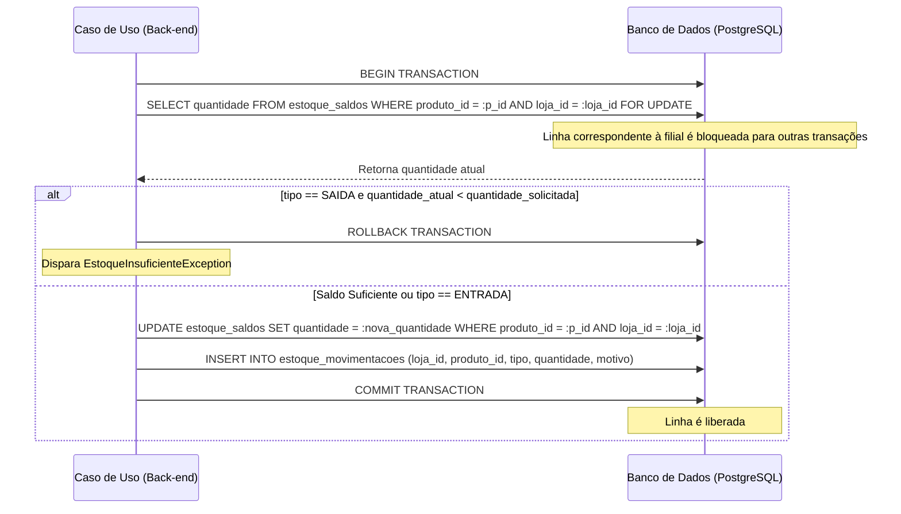

# Roteiro e Pauta de Reunião: Alinhamento do Projeto Gerenciador de Lojas SaaS (Fase 1)

Este documento serve como guia estruturado para a reunião de alinhamento técnico e de escopo com a equipe de desenvolvimento e stakeholders do projeto. A pauta cobre os requisitos funcionais, arquitetura de software, modelagem de banco de dados, regras de negócio críticas de estoque, segurança da informação, fluxo de trabalho Git e diretrizes de desenvolvimento (incluindo regras para assistentes de IA).

---

## 📅 Agenda da Reunião
1. **Apresentação Geral e Escopo** (Módulo de Gerenciamento de Retaguarda / Backoffice).
2. **Stack Tecnológica e Arquitetura** (FastAPI, Clean Architecture, React SPA, Tailwind CSS v4).
3. **Modelagem de Dados e Isolamento SaaS** (Multi-tenancy lógico com UUIDs).
4. **O Coração do Estoque** (Travas pessimistas baseadas em Ledger).
5. **Faturamento e Fluxo Financeiro** (Contas a pagar/receber e crediário próprio).
6. **Segurança, Testes e Logs** (Auditoria e isolamento de banco de testes).
7. **Governança de Código** (Conventional commits, code review obrigatório e governança de IA).

---

## 1. Requisitos do Sistema (Escopo da Fase 1: Backoffice)

A Fase 1 foca estritamente na retaguarda administrativa. O Ponto de Venda (PDV/Boca de Caixa) e hardware térmico local estão **excluídos** deste escopo.

### 📋 Requisitos Funcionais Principais:
* **Autenticação & Controle de Acesso (RBAC)**: Autenticação via tokens JWT contendo `tenant_id` e perfis (`ADMIN_SAAS`, `DONO`, `GERENTE`).
* **Multiloja**: Controle de múltiplas filiais sob a mesma empresa (Tenant).
* **Catálogo Centralizado**: Cadastro único de produtos com cálculo de Markup automatizado a partir do custo.
* **Entrada de Estoque via XML de NF-e**: Importação direta de notas de fornecedores, com cadastro rápido de novos produtos e cálculo automático de preço de custo médio.
* **Matriz de Estoque Multiloja**: Painel visual comparativo exibindo saldos em tempo real em todas as filiais físicas.
* **Inventário de Auditoria Física**: Rotina de contagem física com leitor de barras apontando divergências e perdas antes do ajuste de saldo no banco.
* **Transferência Interlojas**: Movimentação rastreável de produtos entre filiais física com status (`Solicitado`, `Despachado`, `Recebido`, `Divergente`) e exigência de justificativas de quebra.
* **CRM e Contas de Crédito**: Cadastro de clientes fidelidade com controle de limite e saldo de **Crediário Próprio ("Pendura")**.
* **Faturamento de Venda Administrativa**: Vendas manuais registradas diretamente no painel administrativo que deduzem estoque e geram fluxo de caixa integrado.
* **Contas a Pagar & Receber**: Lançamento de despesas manuais, compras de fornecedores e recebíveis futuros de cartões/crediário.
* **Métricas e Dashboards (KPIs)**: Dashboards exibindo receitas vs. despesas, ranking Curva ABC (Top 10), Ticket Médio e alerta físico de ruptura iminente.

---

## 2. Tecnologias Aprovadas (Tech Stack)

| Tecnologia | Função no Ecossistema | Justificativa Técnica |
| :--- | :--- | :--- |
| **Python 3.11+ / FastAPI** | Core do Backend | Performance assíncrona excepcional e documentação automática OpenAPI (Swagger). |
| **PostgreSQL 15** | Banco de Dados Relacional | Suporte avançado a transações relacionais ACID e travas de concorrência complexas. |
| **SQLAlchemy 2.0** | ORM / Query Builder | Mapeamento clássico/imperativo para manter entidades de domínio puras desconectadas do banco. |
| **Redis & Celery** | Workers e Fila de Segundo Plano | Envio assíncrono de alertas de ruptura, e-mails de faturamento diário e tarefas agendadas. |
| **React (Vite + TS)** | Frontend (SPA) | Scaffolding moderno, compilação rápida e tipagem estática no cliente. |
| **Tailwind CSS v4** | Estilização Visual | Nova versão com compilação nativa via Vite Plugin, eliminando PostCSS e simplificando o CSS. |
| **TanStack Query** | Gerenciamento de Estado | Cache inteligente de requisições de backend, evitando tráfego de rede desnecessário. |

---

## 3. Diretrizes de Engenharia e Padrões de Design

A engenharia do sistema deve priorizar clareza, testabilidade, modularidade e desacoplamento. Os seguintes padrões de design devem ser seguidos de forma rigorosa:

### 8.1 Padrão Repository (Repository Pattern)
* Todo acesso a dados deve ser mediado por uma interface de repositório abstrata localizada na subpasta da camada de domínio (`domain/repositories`).
* A implementação relacional (SQLAlchemy) deve ficar exclusivamente dentro da camada de infraestrutura (`infrastructure/database`).
* Este padrão permite mockar o acesso a dados de maneira rápida em testes de unidade e garante o desacoplamento de banco de dados do fluxo lógico de aplicação.

### 8.2 Injeção de Dependências (Dependency Injection)
* O back-end usará o sistema de injeção de dependências do FastAPI (`Depends`) para resolver conexões de banco de dados (`Session`), repositórios concretos e o usuário/tenant logado atual.
* Os Casos de Uso (`use_cases`) devem receber seus repositórios abstratos como dependências de inicialização (`__init__`), permitindo injeção limpa e substituição fácil em ambiente de testes.

### 8.3 Separação Rígida de Entidades vs. Modelos de Tabelas
* As classes em `domain/entities` são classes Python puras (POPO - *Plain Old Python Objects* ou `dataclasses`), livres de metadados de SQLAlchemy ou restrições físicas de banco de dados. Elas expressam as validações lógicas e comportamentais de negócio.
* Os modelos em `infrastructure/database` contêm o mapeamento de tabelas físicas usando SQLAlchemy. A conversão devida é feita por adaptadores ou mapeamento clássico.

### 8.4 Tratamento Global de Exceções
* Nenhuma rota HTTP da camada `web` deve expor traces de exceções internas diretamente.
* Exceções de regras de negócio (herdadas de uma classe base customizada em `domain/exceptions`) devem ser capturadas por manipuladores de exceções globais (`Exception Handlers`) registrados no setup da aplicação FastAPI.
* Os manipuladores traduzirão as exceções de negócio em respostas HTTP apropriadas (ex: `EstoqueInsuficienteException` convertida em `HTTP 422 Unprocessable Entity` com uma mensagem de erro clara em JSON).

---

## 4. O Coração do Estoque: Modelo Baseado em Ledger

Para mitigar os erros comuns de concorrência no estoque (dois gerentes alterando o saldo ao mesmo tempo, ou vendas simultâneas gerando estoques negativos indevidos), **não atualizaremos** diretamente uma coluna de saldo de forma desprotegida.

Utilizaremos o conceito de **Ledger de Movimentações** acoplado a uma tabela de saldo em tempo real por filial (`estoque_saldos`) que sofre bloqueio pessimista via banco de dados (`SELECT FOR UPDATE`).

### 4.1 Caso de Uso: Atualizar Estoque (Fluxo da Transação)



---

## 5. Política Rígida de Segurança da Informação

A segurança da plataforma é prioridade máxima. Toda lógica escrita deve blindar o sistema contra as principais vulnerabilidades de segurança (incluindo o OWASP Top 10):

* **Isolamento de Dados Multi-tenant Absoluto**:
  * Toda e qualquer query de leitura, escrita ou atualização deve ter a cláusula implícita ou explícita `.where(Model.tenant_id == current_tenant_id)`.
  * Nenhum endpoint deve permitir a passagem manual de `tenant_id` no body ou query string em rotas autenticadas de inquilinos; o `tenant_id` deve ser obrigatoriamente injetado a partir da sessão autenticada do token JWT decodificado no backend.
* **Criptografia Rígida de Senhas**:
  * Senhas de colaboradores nunca podem trafegar ou ser armazenadas em texto limpo.
  * A tabela `usuarios` deve salvar as senhas utilizando hashing unidirecional de alto custo computacional (`Argon2` ou `Bcrypt` com salting de no mínimo 12 rounds).
* **Validação e Sanitização contra Injeções**:
  * Proteção total contra *SQL Injection* (SQLi) através do uso exclusivo de parâmetros parametrizados do ORM SQLAlchemy (nunca concatenar strings diretamente para formar queries SQL).
  * Proteção contra *Cross-Site Scripting* (XSS) através da validação, escape e sanitização de strings de entrada recebidas do cliente antes de qualquer persistência.
* **Validação RBAC em Camadas**:
  * A validação de controle de acesso baseado em papéis (Roles: `ADMIN_SAAS`, `DONO`, `GERENTE`) deve ser feita de forma dupla: na rota HTTP (FastAPI dependencies/guards) e reforçada na camada de aplicação (Casos de Uso).
  * A interface do frontend não deve ser o único limitador de segurança. O backend deve assumir que qualquer requisição externa pode ter sido manipulada.

---

## 6. Fluxo de Trabalho Git (Git Workflow)

Para assegurar uma base de código estável, auditável e organizada em equipe, adotaremos as seguintes diretrizes de versionamento:

### 6.1 Branching Strategy (GitHub Flow)
* A branch `main` representa o código em estado de produção estável.
* Todo novo recurso, correção ou refatoração deve ser desenvolvido em uma branch separada criada a partir da `main`.
* **Nomenclatura padrão de branches**:
  * Novos recursos: `feature/nome-do-recurso` (ex: `feature/cadastro-produtos`)
  * Correções de bugs: `bugfix/descricao-do-bug` (ex: `bugfix/vazamento-tenant`)
  * Refatorações: `refactor/descricao` (ex: `refactor/ledger-estoque`)
  * Melhorias/Limpezas: `chore/tarefa` (ex: `chore/ajuste-requirements`)

### 6.2 Convenção de Commits (Conventional Commits)
As mensagens de commit devem seguir o padrão estruturado de Commits Convencionais para facilitar a leitura automática do histórico:
* **Estrutura**: `tipo(escopo): descrição sucinta`
* **Principais tipos**:
  * `feat`: Introdução de um novo recurso funcional.
  * `fix`: Resolução de um bug.
  * `docs`: Alterações exclusivas em documentações ou comentários.
  * `test`: Criação, modificação ou adição de testes automatizados.
  * `refactor`: Alteração de código que não altera o comportamento final do sistema.
  * `chore`: Atualização de builds, dependências, scripts de automação de ambiente ou tarefas administrativas.
* **Exemplos de commits**:
  * `feat(estoque): adiciona ledger com select for update no saldo`
  * `fix(auth): corrige validacao de permissao de role no middleware`
  * `docs(readme): atualiza instrucoes de startup com docker`

### 6.3 Revisão de Código (Pull Requests) e Aprovação por Pares (Code Review)
* Commits devem ser pequenos e atômicos. Evite "mega-commits" com centenas de linhas modificadas que misturam tópicos não relacionados.
* Cada pull request deve ser avaliado contra a esteira automática de testes em CI. A aprovação da branch só é permitida se 100% da suíte de testes passar com sucesso.
* **Revisão Humana Obrigatória**: Antes de qualquer commit ou alteração ser integrada à branch principal (`main`), o código produzido deve ser revisado e aprovado explicitamente por outros membros da equipe de engenharia. É obrigatório que os membros leiam e auditem o código para garantir conformidade com as regras arquiteturais, regras de negócio e boas práticas de segurança.

---

## 7. Diretrizes e Regras Estritas para Desenvolvimento com IA

Todas as IAs ou assistentes que atuarem no desenvolvimento deste projeto devem cumprir rigorosamente as seguintes restrições técnicas e operacionais. Qualquer código produzido fora desses padrões será rejeitado.

### 7.1 Tipagem Estática Rígida (Strict Type Hints)
* **Python**: Todo código desenvolvido no backend deve usar type hints (anotações de tipo) completas. Todas as funções e métodos devem declarar explicitamente o tipo dos parâmetros e do retorno.
  ```python
  def calcular_saldo_futuro(saldo_atual: int, quantidade: int, operacao: str) -> int:
      ...
  ```

### 7.2 Validação de Fronteira por Pydantic
* Nenhum dicionário genérico mutável (`dict`) deve ser aceito nas rotas da API FastAPI para operações de escrita.
* Toda requisição de entrada (`request payload`) e de saída (`response payload`) deve ser mapeada em um schema do **Pydantic** explícito.

### 7.3 Padrão de Idioma do Código e Tabelas
* **Banco de Dados e Entidades Relacionais**: Nomes de tabelas, nomes de colunas e relacionamentos devem ser escritos em **Português** (ex: `nome_fantasia`, `senha_hash`, `preco_venda`, `estoque_saldos`).
* **Lógica Interna do Código**: Os nomes das classes das Entidades de Domínio, Casos de Uso, Controladores e funções auxiliares devem acompanhar os nomes em português para manter a coesão com a nomenclatura do domínio de negócios (ex: classe `EstoqueSaldo`, classe `RegistrarVendaAdministrativa`, classe `LancamentoFinanceiro`).

---

### 7.4 Governança e Processo de Aprovação Prévia (Obrigatório)

> [!IMPORTANT]
> **REDO DE PROJETO BLOQUEADO SEM APROVAÇÃO**: A IA **não tem autorização** para criar novos arquivos de código ou alterar arquivos funcionais existentes de maneira direta sem consentimento prévio do usuário.

* **Fluxo de Trabalho Obrigatório para a IA**:
  1. **Planejamento**: Antes de qualquer escrita de código, a IA deve gerar um plano técnico de implementação (ex: arquivo de plano).
  2. **Apresentação**: A IA deve apresentar o plano detalhando:
     * Arquivos que serão criados ou modificados com links markdown clicáveis.
     * Esquemas ou migrações que serão adicionados ao banco de dados.
     * Lista detalhada de testes automatizados que cobrirão o novo comportamento.
  3. **Aprovação**: A IA deve interromper a execução e **aguardar explicitamente** a aprovação do usuário no chat antes de realizar qualquer modificação de código real ou comando de escrita.

---

## 8. Diretrizes e Padrões de Testes Automatizados

Escrever código funcional sem testes de suporte não é aceito. Cada caso de uso, rota ou modelo deve ser devidamente coberto.

* **Políticas de Cobertura**:
  * **Casos de Uso (Core)**: 100% de cobertura lógica para fluxos felizes e fluxos de exceção.
  * **APIs / Endpoints**: Testes de integração simulando requisições com dados válidos (HTTP 200/201), dados inválidos (HTTP 422), autorização inválida (HTTP 401/403) e limites de concorrência.
* **Ambiente de Testes Isolado**:
  * Testes de integração de API e banco de dados devem rodar obrigatoriamente contra um banco PostgreSQL de testes isolado, separado do banco de desenvolvimento local ou produção.
  * Cada execução de teste deve iniciar uma transação isolada ou truncar as tabelas antes de iniciar para garantir a independência absoluta dos testes (testes herméticos).
* **Testagem de Concorrência e Race Conditions**:
  * A IA deve criar explicitamente testes que validem a trava pessimista (`SELECT FOR UPDATE`) no Ledger de movimentações de estoque por filial, disparando requisições concorrentes simultâneas e assegurando que transações paralelas concorrentes sejam adequadamente tratadas com erro amigável ao cliente (`EstoqueInsuficienteException` ou travamento de fila adequado), bloqueando qualquer cenário de saldo negativo.
* **Testes Negativos e Limites**:
  * Devem ser escritos cenários específicos que testem os limites do sistema, como: tentar comprar acima do estoque disponível, enviar tokens inválidos ou expirados, e tentar acessar dados de outro inquilino (`SaaS Leakage`).
